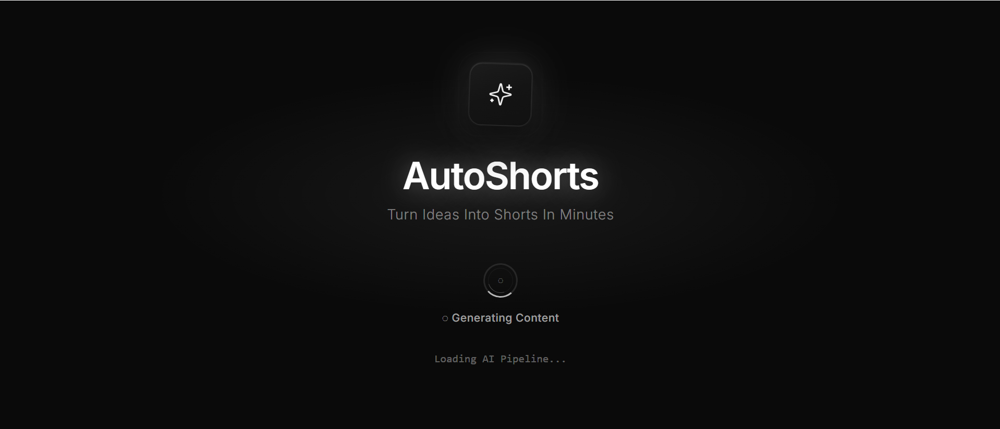
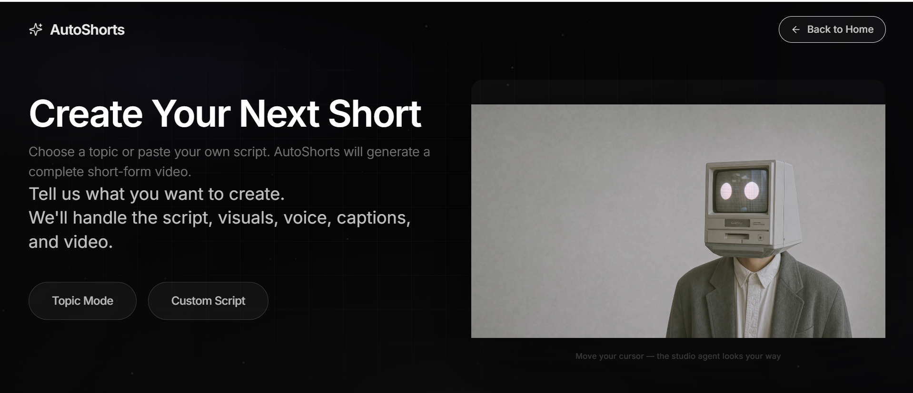

# AutoShorts


**Generate complete short-form videos from a topic or custom script using AI.**

---

AutoShorts transforms a simple idea into a ready-to-publish short-form video. Enter a topic or paste your script — the platform handles the rest.

Automatically generates:

- **Script** — AI-written narration tailored to your topic
- **Voiceover** — Local text-to-speech narration
- **Captions** — Burned-in subtitles for Shorts
- **Scene Plan** — Structured visual breakdown per beat
- **Visual Assets** — Stock footage and images from Pexels & Pixabay
- **Final Video** — Vertical 1080×1920 MP4, ready to download
- **Metadata** — Title and YouTube-ready description with hashtags

---

## Demo

<p align="center">
  <a href="https://github.com/Sahil689172/AutoShorts/raw/main/public/v1.mp4">
    
  </a>
</p>

<p align="center">
  <strong><a href="https://github.com/Sahil689172/AutoShorts/raw/main/public/v1.mp4">▶ Watch full demo (v1.mp4)</a></strong>
</p>

<p align="center">
  <video
    src="https://github.com/Sahil689172/AutoShorts/raw/main/public/v1.mp4"
    controls
    width="720"
  >
    Your browser does not support embedded video.
    <a href="https://github.com/Sahil689172/AutoShorts/raw/main/public/v1.mp4">Download v1.mp4</a>
  </video>
</p>

*Topic → script → voice → visuals → finished Short.*

---

## Screenshots

### Landing — splash screen

<p align="center">
  
</p>

### Create Studio — topic & custom script

<p align="center">
  
</p>

---

## Features

| | |
|---|---|
| **Topic Mode** | Enter a Shorts idea — AI writes the script and runs the full pipeline |
| **Custom Script Mode** | Bring your own narration — skip script generation, keep everything else |
| **AI Script Generation** | Local LLM (Ollama) crafts concise, Shorts-optimized scripts |
| **Voice Generation** | Piper TTS produces natural narration audio |
| **Automatic Captions** | Script-timed or Whisper-based subtitles, burned into the final video |
| **Scene Planning Agent** | Breaks narration into timed scenes with visual descriptions |
| **Visual Search Agent** | Finds and assembles stock clips and images per scene |
| **Video Rendering** | FFmpeg builds a polished vertical Short with captions |
| **Modern Frontend** | React + Vite studio UI with landing page, progress tracking, and results |
| **FastAPI Backend** | REST API for generation, progress polling, and artifact delivery |
| **Local AI Processing** | Ollama, Piper, and Whisper run on your machine — no cloud AI required |

---

## Workflow

```text
Topic / Custom Script
        ↓
Script Generation
        ↓
Voice Generation
        ↓
Caption Generation
        ↓
Scene Planning
        ↓
Visual Search
        ↓
Video Rendering
        ↓
Final MP4 Output
```

Two ways in, one path out. Topic mode generates the script first; custom script mode starts at voice. Both produce the same publish-ready MP4 and metadata.

---

## Tech Stack

**Frontend**

- React
- TypeScript
- Vite
- Tailwind CSS
- Framer Motion

**Backend**

- FastAPI
- Python

**AI**

- Ollama
- Local LLMs (Llama 3)

**Media Processing**

- FFmpeg
- MoviePy

**Assets**

- Pexels API
- Pixabay API

---

## Project Structure

```text
AutoShorts/
├── frontend/          # React web app (landing, create, processing, result)
├── backend/           # FastAPI server, job manager, pipeline runner
├── agents/            # Scene, visual timeline, and asset agents
├── public/            # Demo video and README screenshots
├── videos/            # Rendered output MP4s
├── jobs/              # Per-run API artifacts
├── scripts/           # Generated script, title, and description
├── assets/            # Timeline clips and search cache
├── main.py            # CLI pipeline entry point
└── Readme.md
```

---

## Installation

### Prerequisites

- **Python 3.13**
- **Node.js 18+**
- **FFmpeg** and **ffprobe** on PATH
- **Ollama** with Llama 3 (`ollama pull llama3`)
- **Piper TTS** + voice model under `models/piper/`

### 1. Clone the repository

```bash
git clone https://github.com/your-username/AutoShorts.git
cd AutoShorts
```

### 2. Install backend dependencies

```bash
pip install -r requirements.txt
```

### 3. Install frontend dependencies

```bash
cd frontend
npm install
cd ..
```

### 4. Configure environment

Create a `.env` file in the project root:

```env
PEXELS_API_KEY=your_pexels_key
PIXABAY_API_KEY=your_pixabay_key
```

Optional — frontend API URL (`frontend/.env`):

```env
VITE_API_BASE_URL=http://127.0.0.1:8000
```

### 5. Start the backend

From the project root:

```bash
python -m uvicorn backend.api:app --reload
```

API runs at `http://127.0.0.1:8000` · Docs at `http://127.0.0.1:8000/docs`

### 6. Start the frontend

In a second terminal:

```bash
cd frontend
npm run dev
```

Open `http://localhost:5173` → **Get Started** → create your first Short.

### CLI (optional)

Run the full pipeline from the terminal without the UI:

```bash
python main.py "What is compound interest?"
```

---

## Environment Variables

| Variable | Required | Description |
|----------|----------|-------------|
| `PEXELS_API_KEY` | Yes | Pexels API key for stock videos and images |
| `PIXABAY_API_KEY` | Yes | Pixabay API key for image fallback |
| `VITE_API_BASE_URL` | No | Frontend API base URL (default `http://127.0.0.1:8000`) |

Never commit real API keys. Use `.env` locally and keep it out of version control.

---

## Future Improvements

- **YouTube Upload Agent** — One-click publish with metadata
- **Multi-language Support** — Scripts, voice, and captions in more languages
- **AI Thumbnail Selection** — Smart cover frame picking from the timeline
- **Asset Caching** — Faster re-runs for repeated topics
- **Faster Rendering** — Parallel FFmpeg passes and preset tuning
- **Cloud Deployment** — Hosted API and optional GPU workers

---

## Contributing

Contributions are welcome.

1. Fork the repository
2. Create a feature branch (`git checkout -b feature/my-feature`)
3. Commit your changes (`git commit -m "Add my feature"`)
4. Push to the branch (`git push origin feature/my-feature`)
5. Open a Pull Request

Please keep changes focused and match existing code style.

---

## License

MIT License

Copyright (c) 2026 AutoShorts

Permission is hereby granted, free of charge, to any person obtaining a copy of this software and associated documentation files (the "Software"), to deal in the Software without restriction, including without limitation the rights to use, copy, modify, merge, publish, distribute, sublicense, and/or sell copies of the Software, and to permit persons to whom the Software is furnished to do so, subject to the following conditions:

The above copyright notice and this permission notice shall be included in all copies or substantial portions of the Software.

THE SOFTWARE IS PROVIDED "AS IS", WITHOUT WARRANTY OF ANY KIND, EXPRESS OR IMPLIED, INCLUDING BUT NOT LIMITED TO THE WARRANTIES OF MERCHANTABILITY, FITNESS FOR A PARTICULAR PURPOSE AND NONINFRINGEMENT. IN NO EVENT SHALL THE AUTHORS OR COPYRIGHT HOLDERS BE LIABLE FOR ANY CLAIM, DAMAGES OR OTHER LIABILITY, WHETHER IN AN ACTION OF CONTRACT, TORT OR OTHERWISE, ARISING FROM, OUT OF OR IN CONNECTION WITH THE SOFTWARE OR THE USE OR OTHER DEALINGS IN THE SOFTWARE.

---

<p align="center">
  <strong>AutoShorts</strong> — From idea to Short in minutes.
</p>
